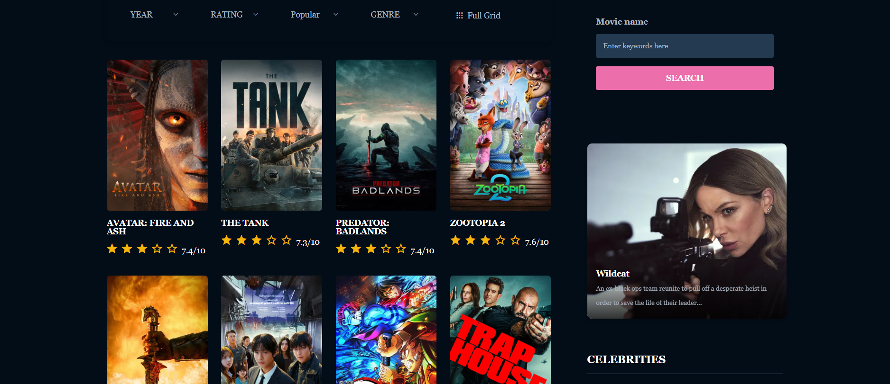
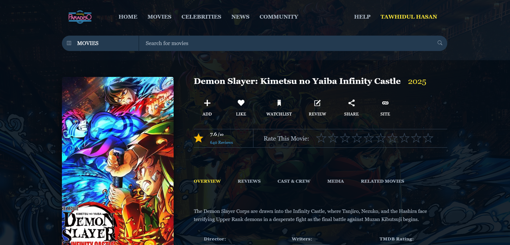
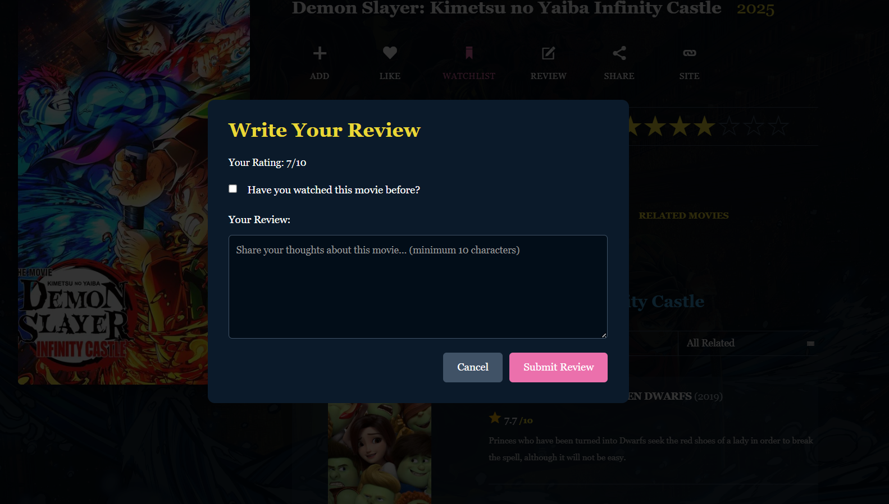
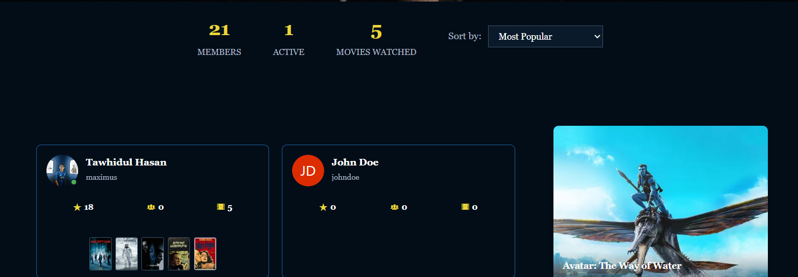

# Cinema Paradiso 🎬

A comprehensive movie and television database web application built with Laravel and modern web technologies. Cinema Paradiso provides users with an extensive platform to discover, track, and discuss movies and TV shows while connecting with a community of film enthusiasts.


*Discover trending movies, TV shows, and get personalized recommendations*

## Overview

Cinema Paradiso is a full-featured entertainment platform that integrates with The Movie Database (TMDb) API to provide users with access to a vast collection of movies, TV shows, and celebrity information. The application combines content discovery with social features, enabling users to build their personal collections, engage with other members, and stay updated with the latest entertainment news.

## Screenshots & Features Overview

### 🏠 Homepage

Browse curated movie recommendations, trending content, and in-theater releases. Features include movie carousels, celebrity spotlights, and video trailers.

### 🔐 Authentication System
<div style="display: flex; gap: 10px;">
  
  
</div>

**Login & Password Recovery**: Secure authentication with email/username login, "Remember Me" functionality, and password reset via email.


**User Registration**: Create new accounts with username, email, password, and optional bio. Password validation ensures minimum 8 characters.

### 👤 User Profile Management

**Profile Customization**: Edit personal information including username, email, name, phone, location (country/state), and bio. Upload custom avatars with real-time preview.


**Top 5 Favorite Movies**: Search and select up to 5 favorite movies to display on your public profile. Visual movie posters with easy selection interface.

### 🎬 Movie Discovery & Details

**Browse Movies**: Filter by year, rating, popularity, and genre. Search by keywords with a comprehensive movie database powered by TMDb API.


**Movie Details**: View comprehensive information including synopsis, ratings, release year, cast, crew, and media. Quick actions to add to collection, like, watchlist, write reviews, and share.

### 📝 Reviews & Ratings

**Community Reviews**: Read detailed reviews from other users with star ratings and timestamps. Filter by newest, oldest, or highest rated.


**Write Reviews**: Rate movies with a 10-star system and share your thoughts (minimum 10 characters). Mark if you've watched the movie before.

### 🎭 Cast & Media

**Cast & Crew Information**: Browse complete cast lists, directors, writers, producers, and music composers. Click on any name to view their full filmography.


**Media Gallery**: Watch trailers, teasers, behind-the-scenes content, and visual trailers. 23+ videos available with subtitled and dubbed versions.


**Discover Similar Content**: Find movies related to what you're viewing with ratings and quick descriptions.

### 👥 Community Features

**Community Directory**: Browse all members with activity statistics (followers, following, movies watched). Sort by most popular users and view their favorite movies.

### 🎭 Celebrities Database

**Celebrity Profiles**: Explore over 4.4 million celebrities with photos, roles, and filmographies. Search by name and sort by popularity.

### 📰 Entertainment News

**Latest News**: Stay updated with entertainment news from Variety, Deadline, The Guardian, and other sources. Articles include images, publication dates, and source attribution.

## Core Features

### 🎥 Content Discovery
- **Extensive Movie Database**: Browse and search through millions of movies with detailed information including cast, crew, ratings, and reviews
- **TV Show Database**: Access comprehensive TV series information with season and episode details
- **Celebrity Profiles**: View detailed information about actors, directors, and other entertainment industry professionals (4.4M+ celebrities)
- **Advanced Search**: Universal search functionality across movies, TV shows, and celebrities with smart filters
- **Genre Filtering**: Browse content by specific genres with year and rating filters
- **Rich Media**: Access 23+ trailers, teasers, behind-the-scenes content, and promotional materials for each title

### 📚 User Collections & Engagement
- **Personal Movie Collection**: Add and organize movies in your personal library with custom lists
- **Watchlist System**: Maintain a list of movies and TV shows to watch later
- **Reviews and Ratings**: Write detailed reviews with 10-star rating system (minimum 10 characters)
- **Top 5 Favorites**: Showcase up to 5 favorite movies on your profile with visual posters
- **Like System**: Heart your favorite movies and track what resonates with you
- **User Statistics**: Track viewing habits, collection statistics, and activity points

### 👥 Social & Community Features
- **Customizable User Profiles**: Personalize profiles with avatars, bio, location, and contact information
- **Avatar Upload**: Upload custom profile pictures with instant preview (JPEG, PNG, GIF up to 2MB)
- **Follow System**: Follow other users to stay updated with their movie activity and reviews
- **Community Directory**: Discover 21+ active members, browse by popularity, and connect with fellow movie enthusiasts
- **Direct Messaging**: Private chat system with message requests for privacy control
- **Activity Tracking**: View follower/following lists and user activity streams
- **Public Profiles**: Share your favorite movies and reviews with the community

### 📰 News & Updates
- **Entertainment News**: Aggregated news from Variety, Deadline, The Guardian, and NewsAPI
- **Multiple Sources**: Quality journalism from trusted entertainment industry sources
- **Reddit Integration**: Access popular movie discussions from Reddit communities
- **Cached Content**: Optimized news delivery with 6-hour intelligent caching for fast loading

### 🔐 Security & Authentication
- **Secure Login**: Email/username authentication with "Remember Me" functionality
- **Password Recovery**: Email-based password reset with temporary password generation
- **User Registration**: Create accounts with validation (8+ character passwords, unique usernames/emails)
- **Session Management**: Secure session handling with CSRF protection
- **Rate Limiting**: Protection against abuse on uploads, messaging, and sensitive endpoints

## Technology Stack

### Backend
- **Framework**: Laravel 12.0
- **Language**: PHP 8.2+
- **Database**: MySQL/PostgreSQL (configurable)
- **Caching**: Redis/File-based caching
- **Queue System**: Laravel Queue with database/Redis driver
- **Email**: Laravel Mail with multiple driver support

### Frontend
- **CSS Framework**: Tailwind CSS 4.0
- **Build Tool**: Vite 7.0
- **HTTP Client**: Axios
- **JavaScript**: Modern ES6+ standards

### External APIs
- **TMDb API**: The Movie Database API for movie and TV show data
- **NewsAPI**: Entertainment news aggregation
- **The Guardian API**: Quality journalism and reviews
- **Reddit API**: Community discussions and trending topics

## Project Structure

```
cinema-paradiso/
├── app/
│   ├── Console/
│   │   ├── Kernel.php
│   │   └── Commands/
│   │       ├── CacheStatus.php              # Check cache status
│   │       ├── FixBrokenPosters.php         # Fix broken poster images
│   │       ├── InvalidateCache.php          # Invalidate specific caches
│   │       ├── OptimizeCache.php            # Optimize application cache
│   │       └── UpdateUserPopularity.php     # Update user popularity scores
│   │
│   ├── Http/
│   │   ├── Controllers/
│   │   │   ├── Controller.php               # Base controller
│   │   │   ├── AuthController.php           # User authentication
│   │   │   ├── BlogController.php           # News and blog posts
│   │   │   ├── CelebrityController.php      # Celebrity information
│   │   │   ├── ChatController.php           # Messaging system
│   │   │   ├── CommunityController.php      # Community features
│   │   │   ├── ContactController.php        # Contact form handling
│   │   │   ├── HomeController.php           # Homepage and search
│   │   │   ├── MovieController.php          # Movie browsing and details
│   │   │   ├── TVShowController.php         # TV show functionality
│   │   │   ├── UserController.php           # User profile management
│   │   │   ├── UserMovieController.php      # User-movie interactions
│   │   │   └── UserTVShowController.php     # User-TV show interactions
│   │   │
│   │   └── Middleware/
│   │       ├── Authenticate.php             # Authentication middleware
│   │       └── CompressResponse.php         # Response compression
│   │
│   ├── Jobs/
│   │   └── WarmCacheJob.php                 # Cache warming background job
│   │
│   ├── Mail/
│   │   ├── ContactNotification.php          # Contact form email
│   │   └── ForgotPasswordMail.php           # Password reset email
│   │
│   ├── Models/
│   │   ├── User.php                         # User model
│   │   ├── Movie.php                        # Movie model
│   │   ├── ChatMessage.php                  # Chat message model
│   │   ├── ChatRequest.php                  # Chat request model
│   │   ├── Contact.php                      # Contact submission model
│   │   ├── UserActivity.php                 # User activity tracking
│   │   ├── UserFavoriteMovie.php            # User favorite movies
│   │   ├── UserFollower.php                 # User follow relationships
│   │   ├── UserMovie.php                    # User movie collection
│   │   ├── UserMovieLike.php                # Movie likes
│   │   ├── UserMovieReview.php              # Movie reviews
│   │   └── UserWatchlist.php                # User watchlist
│   │
│   ├── Providers/
│   │   └── AppServiceProvider.php           # Application service provider
│   │
│   └── Services/
│       ├── ApiRateLimiter.php               # API rate limiting service
│       ├── CacheOptimizationService.php     # Cache optimization
│       ├── MovieService.php                 # Movie data service
│       ├── NewsService.php                  # News aggregation service
│       ├── TVShowService.php                # TV show data service
│       └── UserPopularityService.php        # User popularity calculation
│
├── bootstrap/
│   ├── app.php                              # Application bootstrap
│   ├── providers.php                        # Service providers registration
│   └── cache/
│       ├── packages.php                     # Package manifest cache
│       └── services.php                     # Service manifest cache
│
├── config/
│   ├── app.php                              # Application configuration
│   ├── auth.php                             # Authentication configuration
│   ├── cache.php                            # Cache configuration
│   ├── database.php                         # Database configuration
│   ├── filesystems.php                      # File storage configuration
│   ├── logging.php                          # Logging configuration
│   ├── mail.php                             # Mail configuration
│   ├── queue.php                            # Queue configuration
│   ├── services.php                         # Third-party services (TMDb, APIs)
│   └── session.php                          # Session configuration
│
├── database/
│   ├── factories/
│   │   └── UserFactory.php                  # User factory for testing
│   │
│   ├── migrations/
│   │   ├── 0001_01_01_000000_create_users_table.php
│   │   ├── 0001_01_01_000001_create_cache_table.php
│   │   ├── 0001_01_01_000002_create_jobs_table.php
│   │   ├── 2025_09_30_190326_create_contacts_table.php
│   │   ├── 2025_10_03_213727_add_community_features_to_users_table.php
│   │   ├── 2025_10_20_161423_add_location_fields_to_users_table.php
│   │   ├── 2025_10_20_173048_create_user_movies_table.php
│   │   ├── 2025_10_20_173153_create_user_movie_likes_table.php
│   │   ├── 2025_10_20_173636_create_user_watchlist_table.php
│   │   ├── 2025_10_20_181236_create_user_movie_reviews_table.php
│   │   ├── 2025_10_22_175739_add_media_type_to_user_watchlist_table.php
│   │   ├── 2025_10_23_202109_create_chat_messages_table.php
│   │   └── 2025_10_23_202206_create_chat_requests_table.php
│   │
│   └── seeders/
│       └── DatabaseSeeder.php               # Main database seeder
│
├── public/
│   ├── index.php                            # Application entry point
│   ├── robots.txt                           # Search engine directives
│   ├── test-auth.html                       # Authentication test page
│   ├── test-forgot-link.html                # Password reset test page
│   ├── css/                                 # Compiled CSS files
│   ├── js/                                  # Compiled JavaScript files
│   ├── images/                              # Static images and assets
│   └── storage/                             # Symbolic link to storage
│
├── resources/
│   ├── css/
│   │   └── app.css                          # Main application styles
│   │
│   ├── fonts/                               # Custom web fonts
│   │
│   ├── images/                              # Source images
│   │
│   └── views/
│       ├── layouts/
│       │   └── app.blade.php                # Main application layout
│       │
│       ├── components/
│       │   └── tv-card.blade.php            # TV show card component
│       │
│       ├── partials/
│       │   ├── _header_top.blade.php        # Header partial
│       │   ├── _movieCard.blade.php         # Movie card partial
│       │   ├── _movieCardSmall.blade.php    # Small movie card
│       │   └── _search.blade.php            # Search partial
│       │
│       ├── movies/
│       │   ├── index.blade.php              # Movies listing page
│       │   ├── show.blade.php               # Movie detail page
│       │   ├── search.blade.php             # Movie search results
│       │   └── genre.blade.php              # Movies by genre
│       │
│       ├── tv/
│       │   ├── index.blade.php              # TV shows listing
│       │   ├── show.blade.php               # TV show detail page
│       │   ├── season.blade.php             # Season detail page
│       │   ├── search.blade.php             # TV show search
│       │   └── genre.blade.php              # TV shows by genre
│       │
│       ├── celebrities/
│       │   ├── index.blade.php              # Celebrities listing
│       │   └── show.blade.php               # Celebrity detail page
│       │
│       ├── profile/
│       │   ├── userprofile.blade.php        # User profile page
│       │   ├── userlist.blade.php           # User list page
│       │   ├── usermovies.blade.php         # User movie collection
│       │   ├── userwatchlist.blade.php      # User watchlist
│       │   ├── userreviews.blade.php        # User reviews
│       │   ├── following.blade.php          # Following list
│       │   ├── followers.blade.php          # Followers list
│       │   └── partials/                    # Profile partials
│       │
│       ├── community/
│       │   ├── index.blade.php              # Community directory
│       │   └── profile.blade.php            # Public user profile
│       │
│       ├── chat/
│       │   ├── index.blade.php              # Chat inbox
│       │   └── show.blade.php               # Chat conversation
│       │
│       ├── emails/
│       │   ├── contact-notification.blade.php
│       │   └── forgot-password.blade.php
│       │
│       ├── welcome.blade.php                # Welcome/landing page
│       ├── index_main.blade.php             # Main index page
│       ├── help.blade.php                   # Help page
│       ├── test-auth.blade.php              # Authentication test view
│       ├── bloggrid.blade.php               # Blog grid layout
│       ├── blogdetail.blade.php             # Blog detail page
│       ├── moviegrid.blade.php              # Movie grid layout
│       ├── movielist.blade.php              # Movie list layout
│       ├── celebritygrid01.blade.php        # Celebrity grid (style 1)
│       ├── celebritygrid02.blade.php        # Celebrity grid (style 2)
│       ├── celebritylist.blade.php          # Celebrity list layout
│       └── celebritysingle.blade.php        # Single celebrity page
│
├── routes/
│   ├── web.php                              # Web application routes
│   └── console.php                          # Artisan console routes
│
├── storage/
│   ├── app/
│   │   ├── public/                          # Publicly accessible files
│   │   └── private/                         # Private storage
│   │
│   ├── framework/
│   │   ├── cache/                           # Framework cache files
│   │   ├── sessions/                        # Session files
│   │   └── views/                           # Compiled Blade views
│   │
│   └── logs/
│       └── laravel.log                      # Application logs
│
├── tests/
│   ├── TestCase.php                         # Base test case
│   ├── Feature/                             # Feature tests
│   └── Unit/                                # Unit tests
│
├── vendor/                                  # Composer dependencies (generated)
│
├── .env                                     # Environment configuration (not in VCS)
├── .env.example                             # Example environment file
├── .gitignore                               # Git ignore rules
├── artisan                                  # Artisan CLI executable
├── composer.json                            # PHP dependencies
├── composer.lock                            # Locked PHP dependencies
├── package.json                             # Node.js dependencies
├── package-lock.json                        # Locked Node dependencies
├── phpunit.xml                              # PHPUnit configuration
├── vite.config.js                           # Vite build configuration
└── README.md                                # Project documentation
```

## Installation

### Prerequisites
- PHP 8.2 or higher
- Composer
- Node.js and npm
- MySQL or PostgreSQL database
- Redis (recommended for caching and queues)

### Setup Instructions

1. Clone the repository:
```bash
git clone https://github.com/yourusername/cinema-paradiso.git
cd cinema-paradiso
```

2. Install PHP dependencies:
```bash
composer install
```

3. Install JavaScript dependencies:
```bash
npm install
```

4. Create and configure environment file:
```bash
cp .env.example .env
```

5. Configure your `.env` file with the following essential settings:
```env
APP_NAME="Cinema Paradiso"
APP_URL=http://localhost

DB_CONNECTION=mysql
DB_HOST=127.0.0.1
DB_PORT=3306
DB_DATABASE=cinema_paradiso
DB_USERNAME=your_username
DB_PASSWORD=your_password

TMDB_API_KEY=your_tmdb_api_key
NEWS_API_KEY=your_news_api_key
GUARDIAN_API_KEY=your_guardian_api_key

MAIL_MAILER=smtp
MAIL_HOST=your_mail_host
MAIL_PORT=587
MAIL_USERNAME=your_email
MAIL_PASSWORD=your_password
```

6. Generate application key:
```bash
php artisan key:generate
```

7. Run database migrations:
```bash
php artisan migrate
```

8. Build frontend assets:
```bash
npm run build
```

9. Start the development server:
```bash
php artisan serve
```

10. In a separate terminal, compile assets for development:
```bash
npm run dev
```

### Queue Worker (Optional but Recommended)

For background job processing:
```bash
php artisan queue:work
```

## Configuration

### TMDb API Setup
1. Register for a free account at [The Movie Database](https://www.themoviedb.org/)
2. Navigate to Settings > API and request an API key
3. Add your API key to the `.env` file as `TMDB_API_KEY`

### News API Setup
1. Register at [NewsAPI](https://newsapi.org/)
2. Obtain your API key
3. Add to `.env` as `NEWS_API_KEY`

### The Guardian API Setup
1. Register at [The Guardian Open Platform](https://open-platform.theguardian.com/)
2. Request an API key
3. Add to `.env` as `GUARDIAN_API_KEY`

## Database Schema

The application includes the following primary tables:

- `users`: User accounts and authentication
- `user_movies`: User movie collections
- `user_movie_likes`: Movie likes/favorites
- `user_movie_reviews`: User-submitted movie reviews
- `user_watchlist`: Movies and TV shows on user watchlists
- `chat_messages`: Direct messages between users
- `chat_requests`: Chat request management
- `user_followers`: User follow relationships
- `contacts`: Contact form submissions
- `user_activities`: User activity tracking

## Security Features

- CSRF protection on all forms
- Rate limiting on sensitive endpoints (avatar uploads, messaging, chat requests)
- Password hashing with bcrypt
- SQL injection protection through Eloquent ORM
- XSS protection through Laravel's built-in escaping
- Authentication middleware for protected routes

## Performance Optimization

- **Multi-layer Caching**: Strategic caching of API responses, database queries, and rendered views
- **Image Optimization**: Lazy loading and responsive images
- **Database Indexing**: Optimized queries with proper indexing
- **API Rate Limiting**: Prevents excessive API calls with intelligent rate limiting
- **Queue System**: Offloads time-intensive operations to background jobs
- **Asset Bundling**: Vite-powered asset compilation and minification

## API Endpoints

### Public Endpoints
- `GET /` - Home page
- `GET /movies` - Browse movies
- `GET /movies/{id}` - Movie details
- `GET /tv` - Browse TV shows
- `GET /tv/{id}` - TV show details
- `GET /celebrities` - Browse celebrities
- `GET /blog` - Entertainment news
- `GET /community` - Community member directory

### Protected Endpoints (Authentication Required)
- `POST /movies/add` - Add movie to collection
- `POST /movies/like` - Like/unlike a movie
- `POST /movies/watchlist` - Add/remove from watchlist
- `POST /movies/review` - Submit movie review
- `GET /messages` - View messages
- `POST /messages/{receiver}/send` - Send message
- `POST /profile/follow/{userId}` - Follow user
- `POST /profile/update` - Update profile

## Testing

Run the test suite:
```bash
php artisan test
```

Run specific test suites:
```bash
php artisan test --testsuite=Feature
php artisan test --testsuite=Unit
```

## Contributing

Contributions are welcome. Please follow these guidelines:

1. Fork the repository
2. Create a feature branch (`git checkout -b feature/your-feature-name`)
3. Commit your changes (`git commit -m 'Add comprehensive description'`)
4. Push to the branch (`git push origin feature/your-feature-name`)
5. Open a Pull Request

Please ensure your code follows PSR-12 coding standards and includes appropriate tests.

## Code Style

This project follows PSR-12 coding standards. Format your code using Laravel Pint:
```bash
./vendor/bin/pint
```

## License

This project is licensed under the MIT License. See the LICENSE file for details.

## Acknowledgments

- [The Movie Database (TMDb)](https://www.themoviedb.org/) for providing comprehensive movie and TV show data
- [NewsAPI](https://newsapi.org/) for entertainment news aggregation
- [The Guardian](https://www.theguardian.com/) for quality journalism
- Laravel community for the excellent framework and ecosystem

## Support

For issues, questions, or contributions, please open an issue on the GitHub repository.

## Project Status

Active development. New features and improvements are regularly added.

---

Built with Laravel and Tailwind CSS

